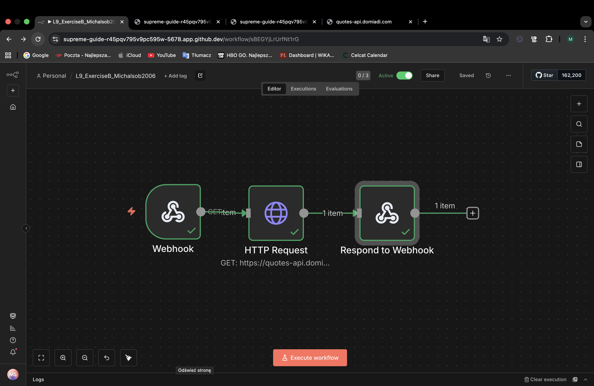
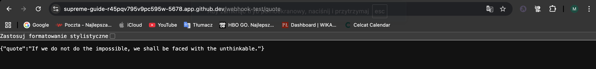
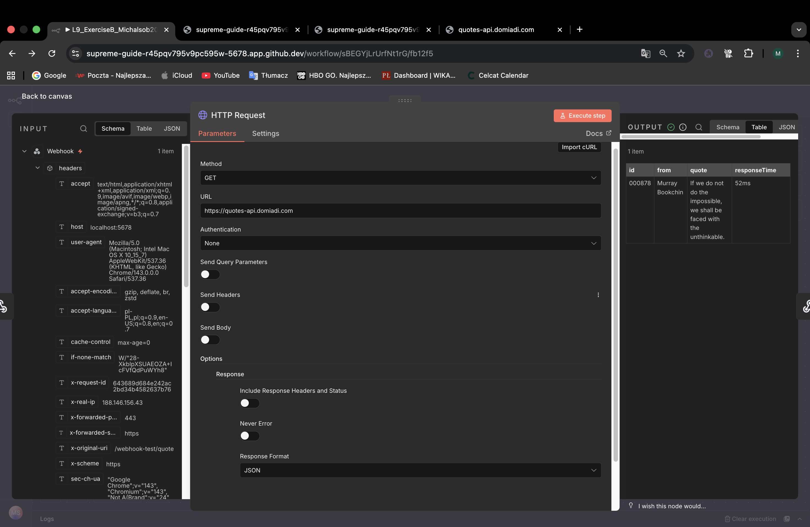
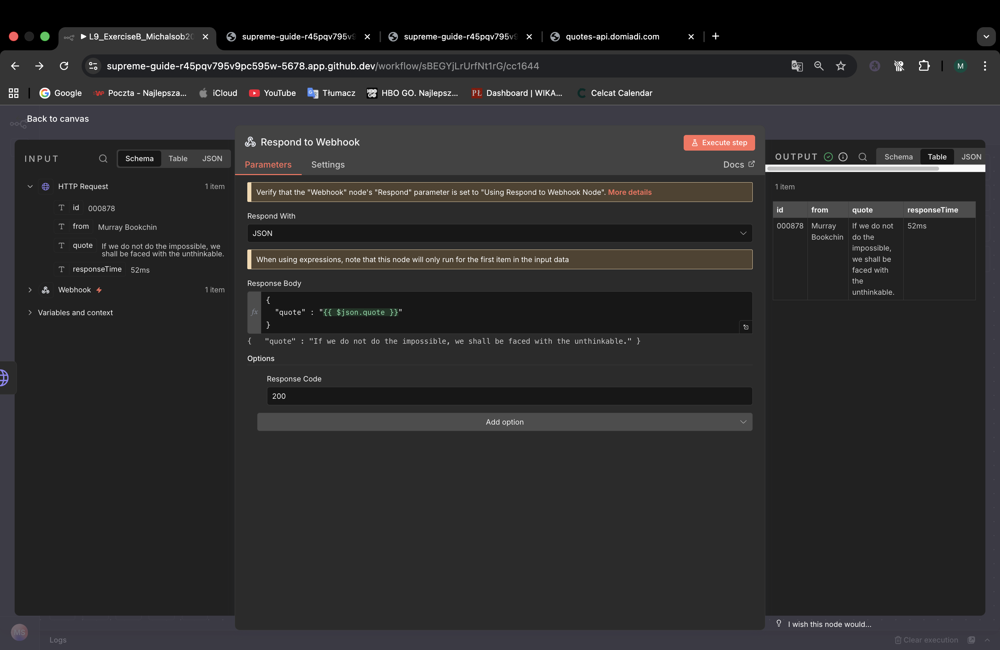

Summary:

I created a new n8n workflow called L9_Exercise_Michalsob2006.

The workflow uses a webhook to handle incoming requests.

After that, I added an HTTP request node to fetch a ranom quote from external API.

Finally, I used a responded to webhook node to return the quote as JSON response.

I tested the workflow using the htest webhook and then activated it for production use.
