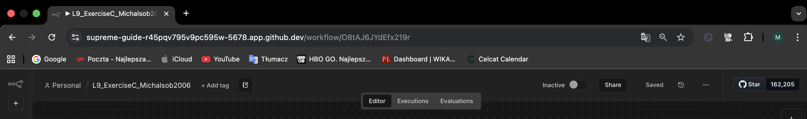
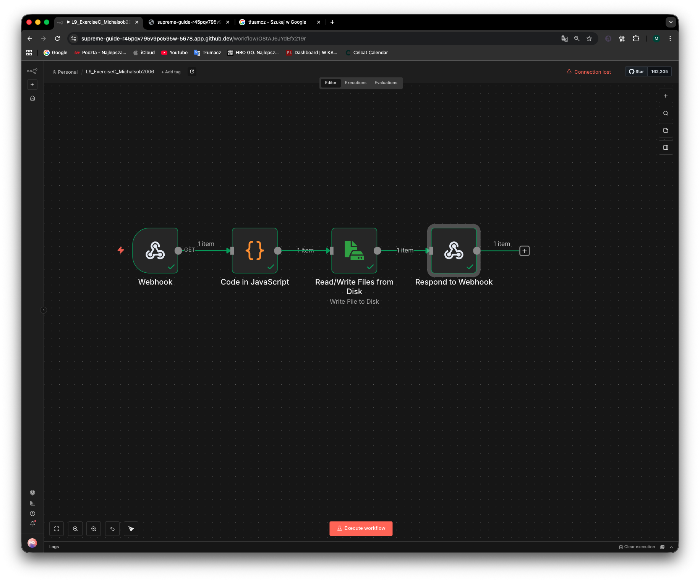
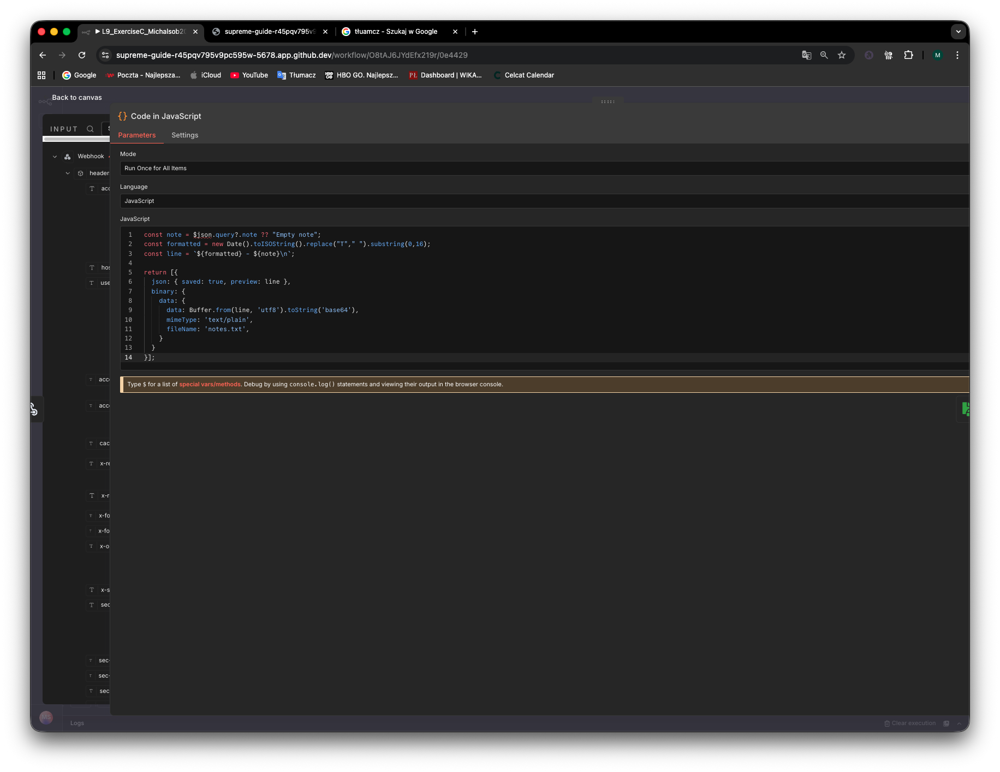
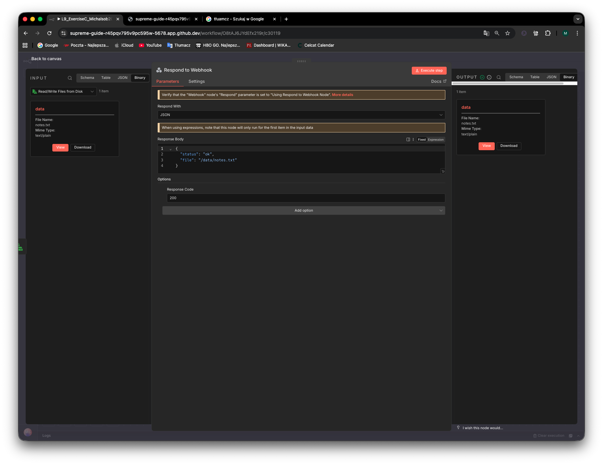
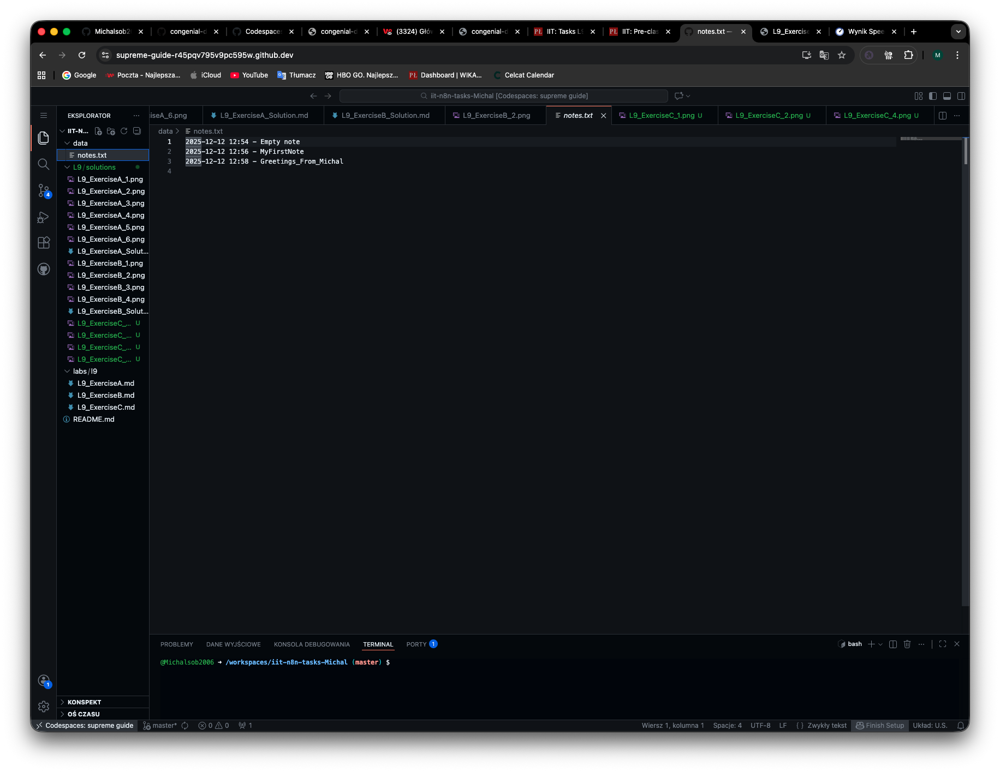
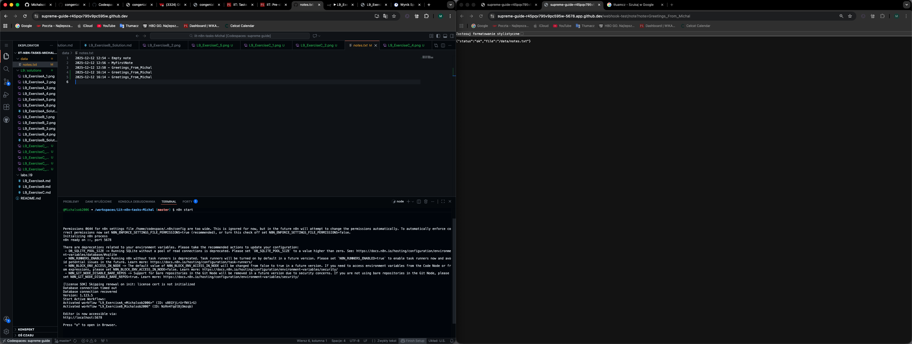

Summary:

I created a new n8n workflow called L9_exerciseC_Michalsob2006.
The workflow uses a webhook to recive a note from url.
Then a code note adds a timestamp and prepares the note as a text line.
After that, the note is appended to a notes.txt file in the /data folder.
Finally, the workflow returns a simple JSON response confirming that the note was saved.

I tested the workflow and verified that new notes are correctly added to the file, then activated it for production use.